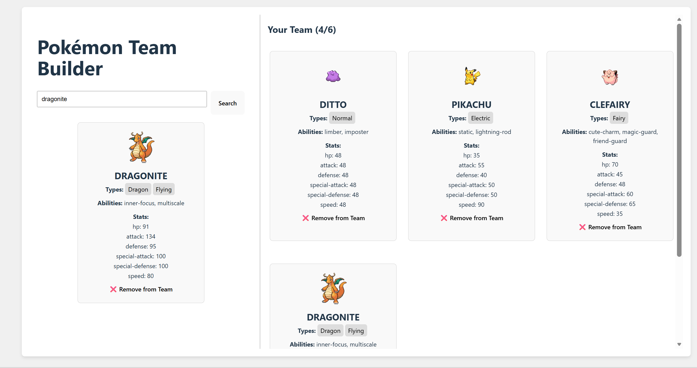
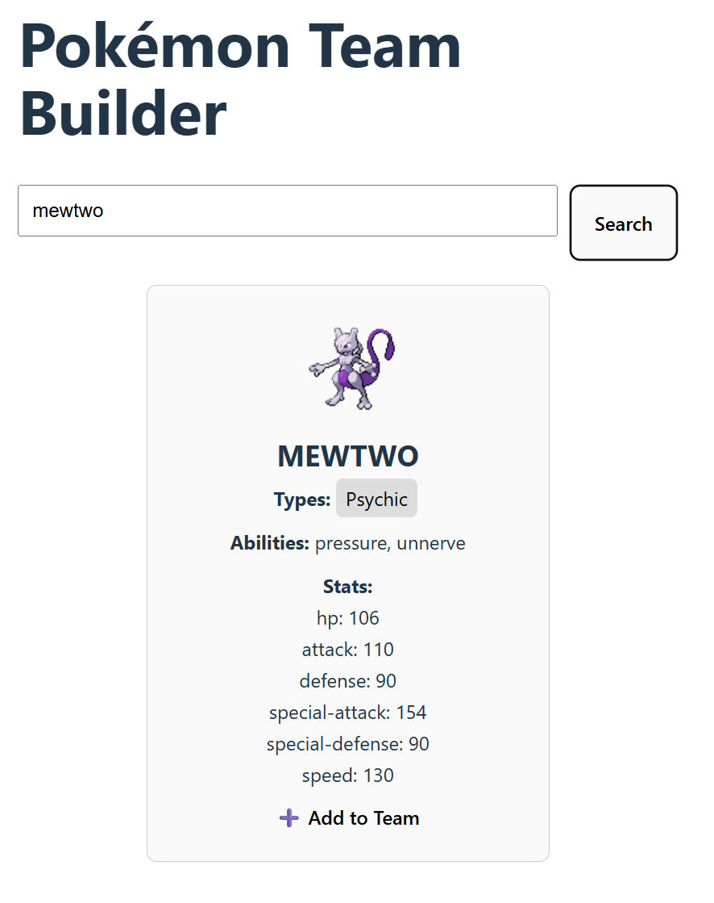
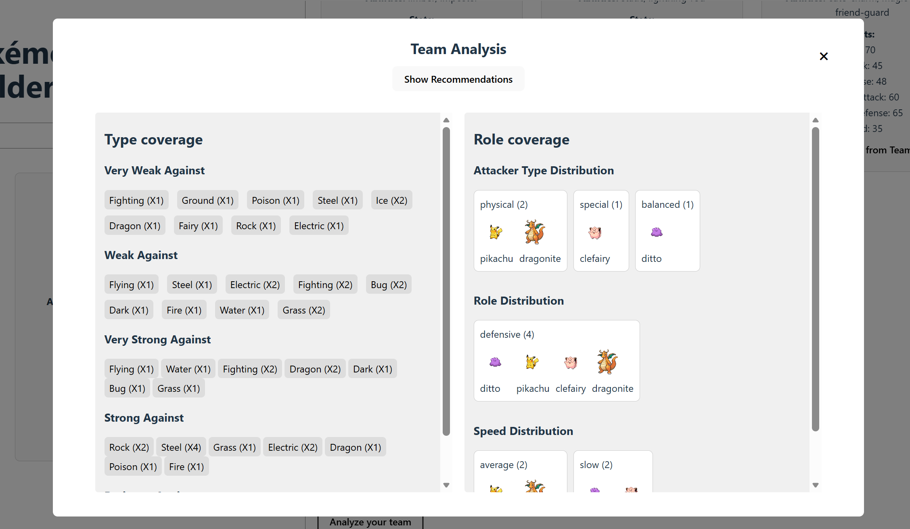
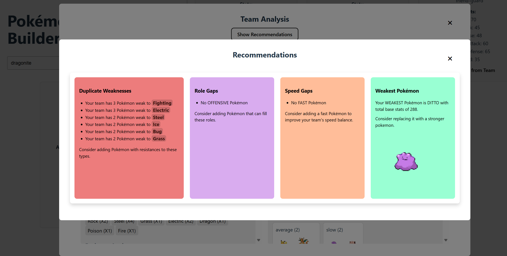

# Pokémon Team Builder

## Overview

This project is a Pokémon Team Builder web application that allows users to create a team of 
Pokémon and analyze the team's type coverage, role distribution, and strengths/weaknesses.

## Setup Instructions

1. Clone the repository using `git clone <repo-url>`
2. Navigate to the project directory `cd pokemon-team-builder`
3. Install dependencies using `npm install`
4. Run the project using `npm run dev`
5. Open the application in your browser and go to http://localhost:5173 in your browser.

## Testing Instructions

- No automated tests are implemented in this version; future improvements could include unit tests for data transformation and analysis functions.
### Manual testing steps:
- Happy path testing:
  - Search for Pokémon by name and verify correct data is displayed (name, types, stats, abilities).
    
  - Add & Remove Pokémon to the team.
    
  - Open team analysis popup to check type coverage and role coverage.
    
  - Click show recommendations to see suggestions for improving the team.
    
  - Ensure API data loads correctly and UI updates as expected.
- Error handling:
  - Search for a non-existent Pokémon and verify error message is displayed.
  - Try adding more than 6 Pokémon to the team and verify it prevents adding more.
  - Check that you cannot add duplicate Pokémon to the team (add button should be hidden)
  - Remove Pokémon from the team and verify analysis updates accordingly.
  - Test edge cases like adding Pokémon with multiple types, or Pokémon with very high/low stats to see how it affects analysis and recommendations.
### Sample Pokémon to Try
  Here are some Pokémon you can search for:
    - Pikachu
    - Charizard
    - Bulbasaur
    - Gengar
    - Snorlax
    - Machamp
    - Alakazam
    - Gyarados
    - Dragonite
    - Mewtwo

**Approach**
- Built with **React** for the frontend.
- Uses **PokéAPI** to fetch Pokémon types and stats.
- Analysis is done client-side:
    - Type weaknesses/strengths are calculated from API `damage_relations`.
    - Stats are analyzed to categorize Pokémon as `physical`, `special`, `balanced`, `defensive`,
      `offensive`, `fast`, `slow`, `average` etc.
- Pop-up modal displays **team analysis** with type coverage, role coverage and recommendations.

**Architecture**
- Built as a single-page React app with reusable components.
- Follows a simple component-based structure (kind of like a lightweight MVC within React).
    - **View:** The UI components that display team analysis and recommendations.
    - **Controller/Logic:** Inside components (mostly hooks) handling data fetching, processing, and analysis.
    - **Model/Data:** Pokémon data is fetched from the PokéAPI and stored in component state (`useState`).
- All analysis is done client-side; data lives in memory and will reset on page refresh.
- Designed for simplicity, keeping the app reactive and interactive without a backend.

## Features
* Search for Pokémon by name
* Add and remove Pokémon from a team
* View Pokémon name, types, stats, and abilities
* Team analysis (type coverage, role distribution)
* Type coverage analysis(weaknesses, strengths, resistances)
* Role distribution analysis (physical, special, defensive, offensive, speed)
* Team recommendations based on weaknesses and missing roles

## Data Source

Pokémon data is retrieved from the PokéAPI.

## Technologies Used

* React
* JavaScript
* CSS
* PokéAPI

## Assumptions / Challenges

### Assumptions:
   - Pokémon stats from PokéAPI are correct and complete. 
   - Weakest Pokémon is determined by sum of base stats, not actual battle performance.
   - Team recommendations are based on type weaknesses and role distribution, not specific Pokémon matchups. 
   
### Design Decisions:
   - Chose React for a dynamic and interactive UI.
   - Used client-side analysis for simplicity and to avoid backend complexity.
   - Focused on core features first, with plans for future improvements.

### Type Coverage Logic
- Used **PokéAPI `damage_relations`** to figure out weaknesses and strengths.
    - Example: `double_damage_from` → counts as **very weak**, building a spectrum of type coverage for the team.

### Role Distribution Logic
- Categorized Pokémon by stats:
    - **Attacker Type:** `attack > special-attack` → physical, `special-attack > attack` → special, else balanced.
    - **Speed:** speed > 100 → fast, speed < 50 → slow, else average.
    - **Roles:** sum of defense + special-defense + HP → defensive if >100, else offensive.

### Team Recommendations Logic

- **Type Weaknesses:**
    - Check the team’s combined weaknesses. If multiple Pokémon are weak to a type, suggest adding Pokémon that resist it.

- **Role & Speed Gaps:**
    - Look at role distribution (physical, special, defensive, offensive, speed). If a role is missing (e.g., no fast Pokémon), flag it.

- **Weakest Pokémon:**
    - Identify the Pokémon with the lowest total base stats and suggest replacing it or adding Pokémon that cover its weaknesses.
  
## Future Improvements
* Improved UI and styling
* Better team recommendation logic
* Additional team statistics
* Add automated testing
* Add filtering and sorting options for Pokémon search
